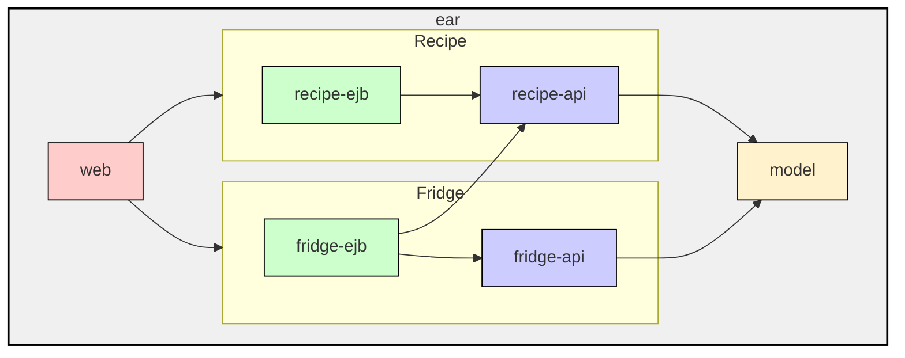

# Cocktails

## Architektur



## Ausgangslage

In diesem Projekt arbeitet ihr mit:

- JSF
- CDI
- JPA
- Remote-EJB innerhalb einer EAR

Ihr arbeitet mit einem lokal installierten WildFly und einer deployten EAR-Datei.

Zur Orientierung dient euch folgendes Beispiel:

- [cocktails.xhtml](cocktails-web/src/main/webapp/cocktails.xhtml)
- [CocktailBean.java](cocktails-web/src/main/java/com/example/cocktails/web/controller/CocktailBean.java)

Verwendet dieses Beispiel als Vorlage für die anderen Aufgaben.

## Arbeiten mit lokalem WildFly

Verwendet einen lokal installierten WildFly. Die EAR wird über das WildFly-Maven-Plugin gestartet und später erneut deployt.

### Vorbereitung in IntelliJ IDEA

Bevor ihr den Server das erste Mal startet, führt ihr im Modul `socialdrinks-cocktails` einmal Folgendes aus:

```bash
mvn clean install
```

In IntelliJ findet ihr das unter:

- `socialdrinks-cocktails > Lifecycle > clean + install`

Der erste vollständige Build ist wichtig, damit alle benötigten Artefakte für das EAR vorhanden sind.

### Server starten

Startet den Server anschließend im Modul `cocktails-ear` über:

- `cocktails-ear > Plugins > wildfly > wildfly:run`

Dabei wird der lokale WildFly gestartet und die EAR deployt. Lasst diesen Prozess geöffnet, solange ihr an der Anwendung arbeitet.

### Änderungen testen

Nach jeder Änderung führt ihr im Modul `socialdrinks-cocktails` einfach Folgendes aus:

- `socialdrinks-cocktails > Lifecycle > deploy`

Dadurch werden die benötigten Module neu gebaut und die EAR wird auf den laufenden WildFly erneut deployt. Ein Server-Neustart ist dafür nicht nötig.

### Hinweise zum Entwicklungsablauf

- Ihr müsst nicht `clean` ausführen.
- Ihr müsst den Server nach normalen Code-Änderungen nicht neu starten.
- Arbeitet in IntelliJ ganz normal weiter. Nach dem Speichern oder Kompilieren führt ihr nur noch `socialdrinks-cocktails > Lifecycle > deploy` aus.
- Falls ihr den Server beendet habt, startet ihn erneut mit `cocktails-ear > Plugins > wildfly > wildfly:run`.

## Aufgaben

### Aufgabe 1: Cocktail-Detailseite vervollständigen

Implementiert die Detailansicht eines Cocktails.

- Bearbeitet [CocktailDetailBean.java](cocktails-web/src/main/java/com/example/cocktails/web/controller/CocktailDetailBean.java)
- Ladet den ausgewählten Cocktail über `RecipeServiceRemote`
- Zeigt die Daten anschließend auf `cocktailDetail.xhtml` an

### Aufgabe 2: Suche implementieren

Implementiert die Suche nach Cocktails.

- Bearbeitet [CocktailSearchBean.java](cocktails-web/src/main/java/com/example/cocktails/web/controller/CocktailSearchBean.java)
- Übernehmt den Suchbegriff aus dem Formular
- Der Suchbegriff muss mindestens 3 Zeichen haben
- Falls nicht, wird eine Meldung angezeigt
- Die Validierung kann über Validation-Annotationen direkt in der Bean-Klasse umgesetzt werden
- Führt die Suche über `RecipeServiceRemote` aus
- Zeigt die Treffer auf `search.xhtml` an

### Aufgabe 3: Zutatenliste implementieren

Implementiert die Übersicht aller Zutaten.

- Bearbeitet [IngredientBean.java](cocktails-web/src/main/java/com/example/cocktails/web/controller/IngredientBean.java)
- Ladet alle Zutaten über `RecipeServiceRemote`
- Zeigt die Liste auf `ingredients.xhtml` an

### Aufgabe 4: Zutaten-Detailseite vervollständigen

Implementiert die Detailansicht einer Zutat.

- Bearbeitet [IngredientDetailBean.java](cocktails-web/src/main/java/com/example/cocktails/web/controller/IngredientDetailBean.java)
- Ladet den Namen der Zutat
- Ladet die Cocktails, die diese Zutat enthalten
- Zeigt beides auf `ingredientDetail.xhtml` an

### Aufgabe 5: Kühlschrank-Webschicht anbinden

Bindet die JSF-Webschicht an das Fridge-EJB an.

- Bearbeitet [FridgeBean.java](cocktails-web/src/main/java/com/example/cocktails/web/controller/FridgeBean.java)
- Ergänzt bei Bedarf [cocktails-web/pom.xml](cocktails-web/pom.xml)
- Wählt einen Scope, der für den ganzen Browser gilt
- Ein anderer Browser soll einen anderen Kühlschrank sehen
- Implementiert folgende Funktionen:
- Zutat hinzufügen
- Zutat entfernen
- Zutaten im Kühlschrank anzeigen
- fehlende Zutaten anzeigen
- mögliche Cocktails anzeigen
- Shopping-Daten anzeigen

### Aufgabe 6: Einkaufsliste im aktuellen Tab speichern

Implementiert die Einkaufsliste so, dass sie nur im aktuellen Browser-Tab gespeichert bleibt.

- Bearbeitet [ShoppingBean.java](cocktails-web/src/main/java/com/example/cocktails/web/controller/ShoppingBean.java)
- Wählt einen Scope, der nur für den aktuellen Tab gilt
- Ein anderer Tab soll eine eigene Einkaufsliste sehen
- Implementiert folgende Funktionen:
- Einkaufsliste anzeigen
- fehlende Zutaten hinzufügen
- einzelne Zutaten entfernen
- Einkaufsliste leeren

### Aufgabe 7: Remote-EJB im Fridge-Service implementieren

Implementiert die EJB-Verbindung zwischen `FridgeService` und `RecipeServiceRemote`.

- Bearbeitet [FridgeService.java](cocktails-fridge-ejb/src/main/java/com/example/cocktails/fridge/ejb/service/FridgeService.java)
- Ergänzt bei Bedarf [cocktails-fridge-ejb/pom.xml](cocktails-fridge-ejb/pom.xml)
- Injiziert `RecipeServiceRemote`
- Nutzt den Rezept-Service, um Zutaten und Cocktails zu laden
- Der Kühlschrank braucht die vollständige Zutatenliste über diese Remote-EJB
- Implementiert damit:
- Zutaten hinzufügen und entfernen
- fehlende Zutaten berechnen
- mögliche Cocktails berechnen
- Shopping-Daten aufbauen

## Hinweise

- Alle Stellen mit `TODO Aufgabe ...` sind absichtlich unvollständig.
- Arbeitet schrittweise und testet jede Aufgabe einzeln.
- Verwendet das vorhandene Cocktails-Beispiel als Vorlage für EJB-Zugriffe aus der Webschicht.
- Änderungen an Java-Code, XHTML-Dateien und Ressourcen werden erst nach einem neuen `deploy`-Lauf in die EAR übernommen.
